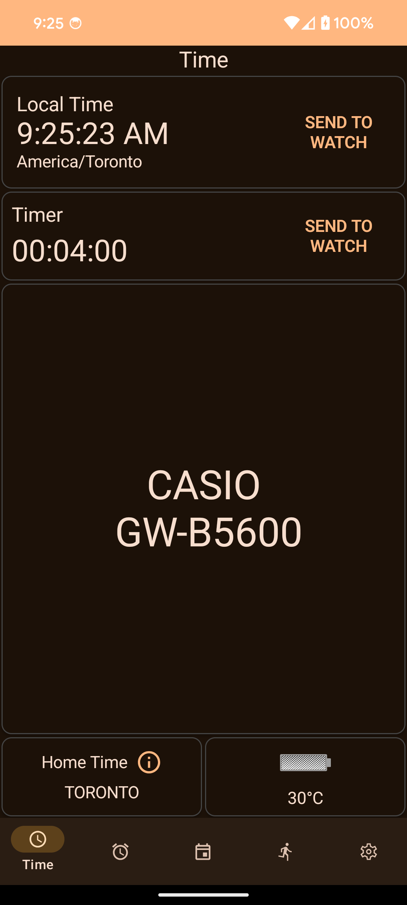
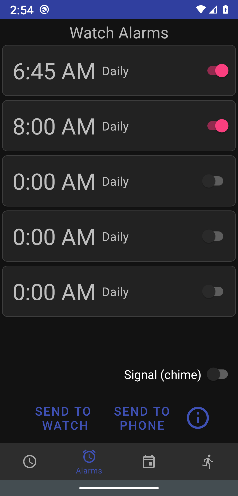
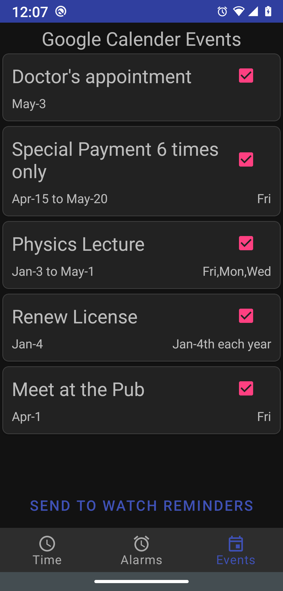
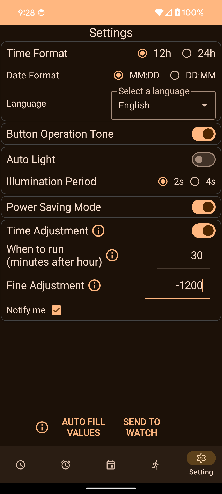

# Casio G-Shock Smart Sync

I think we can do better than the official Casio Connected App! This app provides the following extra features:

- Sets watch's reminders from Google Calendar
- Automatically sets correct timezone when setting time while travelling. No need to switch between Word Time and Home time
- Use your watch to trigger actions on your phone remotely, like taking pictures, dialling a phone number, etc.
- Auto-configure most watch settings from phone's configuration.
- Phone's alarms can be synced with watch's alarms.

This app supports the G-Shock Square Bluetooth [5600](https://amzn.to/3Mt68Qb) and [5000](https://amzn.to/4194M13) series watches.

## General

The app works by sending commands to the watch via Bluetooth (BLE). The watch data is not persisted on the phone, but instead is read from the watch each time 
a connection is established. Any changes on the app are sent back to the watch, only when the `Send to Watch` button is pressed.  

## Setting Time

The local time can be set from the main screen by pressing the `Send to Watch` button next to the current time display. The app uses your current location to get the local lime.
You can then set the watch time accordingly, without having to change your `World Time` selection on the watch.

This screen also shows your `Home Time` location and battery level.

## Alarms

The B5600/B5000 watches have 5 alarms and a `Signal` or `chime` setting. They are first read from the watch,
and displayed in the app. The alarms can be updated by pressing on the time display of each alarm. 
A dialog will appear which allows you to select the time.

Once the alarms have been set, you can send them to the watch, or send them to the `Alarm Clock` app on the phone. 
Unfortunately, there is currently no way to read the alarms from the `Alarm Clock` app programmatically, 
so we cannot set the watch alarms from this app. However, we can set the `Alarm Clock` app with the watch's alarms.

## Events

> Make sure you have set your phone to auto-sync to your google account. Otherwise, adding events in your phone will not be reflected to the Google account, and you will not be able to see the events in the app.

This screen displays `Events` from your `Google Calendar` and allows you to send these events to the watch's `reminders`.
(*don't confuse these with `reminders` in the Google Calendar app. These reminders are special features and are not accessible programmatically*).

There are many ways to set calendar events in `Google Calendar`. Events could be `one time`, repeating `daily`, `weekly`, `monthly` 
or `yearly`, or some complex period such as `every second Thursday of the month`. There are also events which occur number of 
times only (count events), like `repeat this event 12 times every Monday`. Not all event types can be supported on the watch, but this app 
attempts to adopt the calendar events to the watch as much as possible. The only **not** supported event types are `daily` and complex events, 
such as `every second Thursday of the month`. Count events are simulated on the watch with a start and end date, 
matching the event start time, count and frequency. In case the calendar event cannot be adopted to a watch reminder, 
the app will display the event as `Incompatible`. Only future events and recurring events which have not expired are displayed.

The watch only supports `all-day reminders`. However, if the Google calendar event has a specific time,
it will still be used as a day reminder on the watch.

## Actions

The selected actions are run when the user short-presses the lower-right watch button from disconnected mode (initial screen). Using these actions, the watch acts like a remote control for your phone.

## Settings

This screen allows you to set up the watch's settings. You can auto prefill the values using information from your phone.

## Build Your Own App
For those who want to build their own Android app for interfacing with the G-Shock 5000/5600 watches, I have also created an API (library) project [here](https://github.com/izivkov/GShockAPI). 

