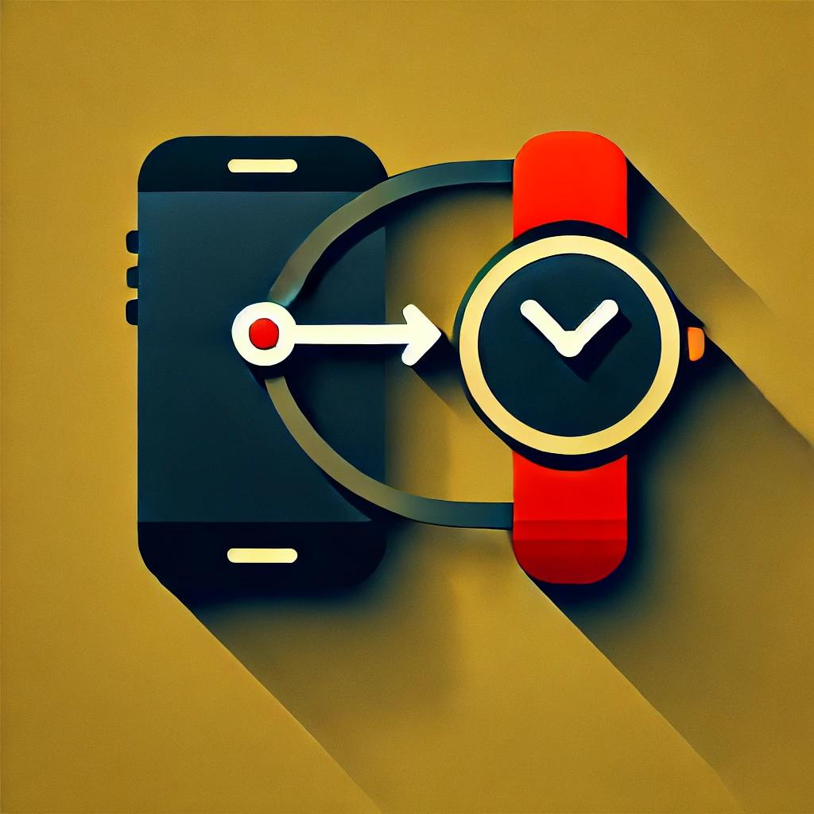
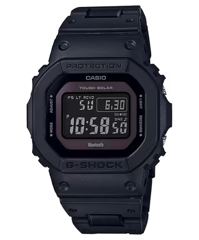
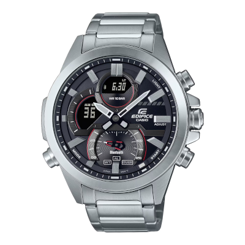
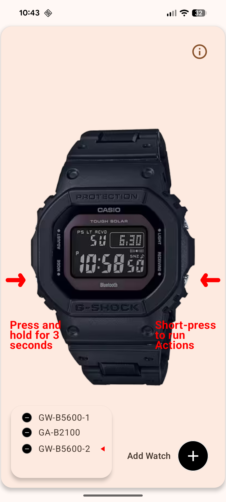
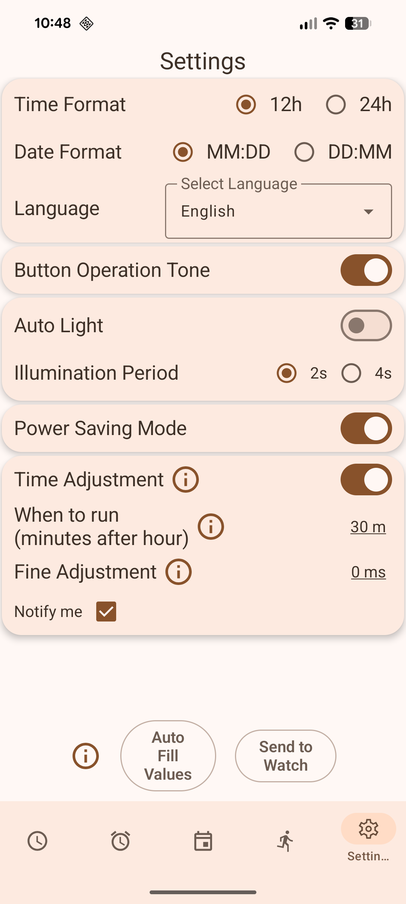

# Casio G-Shock Smart Sync

  

**G-Shock Smart Sync** is an unofficial, open-source Android app for G-Shock, Edifice, and Pro Trek watches. It allows you to control your watch, sync data, and configure settings **without a Casio ID**.

It offers a faster, privacy-focused, and more powerful alternative to the official Casio app.

---

## Key Features

- **No Account Required**: Skip the Casio ID login entirely.
- **Calendar Sync**: Push your calendar events (Google, Samsung, etc.) to your watch as reminders.
- **Auto Timezone**: Automatically adjusts watch time when you travel.
- **Remote Control**: Use your watch buttons to take photos, control music, or launch voice assistants.
- **Alarm Sync**: Configure watch alarms easily from your phone.
- **Phone Finder**: Trigger a loud alarm on your phone to find it.

---

## Supported Watch Models

The app works with many Bluetooth-enabled G-Shock, Edifice, and Pro Trek models.

  
  
  
  

| Series | Compatible Models (Examples) | Note |
|:---|:---|:---|
| **Square** | GW-B5600, GMW-B5000, GW-5000, DW-B5600 | Classic square design support |
| **CasiOak** | GA-B2100, GBM-2100 | Solar and Bluetooth variants |
| **G-Steel** | GST-B500, GST-B400, GST-B200 | Metal series |
| **Edifice** | ECB-10, ECB-20, ECB-30 | Bluetooth Edifice models |
| **Others** | GBD-800, GBD-H1000, GG-B100 (Mudmaster) | Step trackers and sensors |

> **Note**: While these watches connect, not all specific hardware features (like fitness tracking steps on GBD models) may be fully supported yet.

---

## App Walkthrough

Here is a guide to the main screens of the application.

### 1. Connection Screen

This is the first screen you see. It handles the Bluetooth connection to your watch.

- **Status**: Shows generic connection status.
- **Scan/Connect**: Automatically scans for your watch.
- **Paired Devices**: Lists your previously connected watches for quick access.

The app communicates directly with the watch via BLE. Connection is typically much faster than the official app (~3.5s vs 12s).

 

### 2. Time Setting

Manage your watch's timekeeping effortlessly.

- **Local Time**: Displays the current time from your phone.
- **Send to Watch**: Tap the button to sync your phone's time, timezone, and DST settings to the watch immediately.
- **Home Time**: Shows the 'Home' city configured on the watch.
- **Battery**: Displays the current battery level of the watch (e.g., High, Medium, Low).

 

### 3. Alarms

Read and configure the alarms stored on your watch.

- **View Alarms**: See the current settings for all 5 alarms and the hourly signal (Chime).
- **Edit**: Tap any alarm to change its time.
- **Sync**: You can send these alarm settings to the watch. 

*Note: Due to Android limitations, we cannot read alarms set in your phone's native Clock app, but we can set the watch's internal alarms.*

 

### 4. Events (Calendar Sync)

Sync your Android calendars to your watch!

- **Upcoming Events**: Lists future events from your phone's calendars.
- **Send to Watch**: Pushes these events to the watch's Reminder feature.
- **Compatibility**: Supports standard Android calendar events. Complex recurrence rules might show as "Incompatible".

The watch will display these as reminders with the date and title.

 

### 5. Actions (Remote Control)

Turn your watch into a remote control. Assign actions to button presses on the watch.

- **Available Actions**:
  - **Find Phone**: Make your phone ring loudly.
  - **Take Photo**: Snap a picture with your phone's camera.
  - **Flashlight**: Turn on your phone's flashlight.
  - **Next Track**: Skip music tracks on your phone.
  - **Voice Assist**: Launch Google Assistant.
  - **Set Prayer Alarms**: Set the watch's 5 alarms to Islamic Prayer Times
- **How to use**: Short-press the lower-right button on the watch (when in Time mode) to trigger the selected action.

*Note*: The **Take Photo** action requires the app to be in the foreground. If the app is in the background, the action will not work.

 

### 6. Settings

Configure app and watch preferences.

- **Watch Settings**: Adjust specific watch configurations (light duration, power saving, etc.).
- **App Settings**: Configure theme, behavior, and advanced options.

 

---

## Installation

- **F-Droid**: [Download here](https://f-droid.org/en/packages/org.avmedia.gshockGoogleSync/)
- **GitHub**: [Download APK from Releases](https://github.com/izivkov/CasioGShockSmartSync/releases/tag/v26.6)

## Contributing

We welcome contributions!
- **Code**: Submit a PR to add features or fix bugs.
- **Watches**: If you have a G-Shock model not yet supported, functionality can often be added. Donations of test units are also highly appreciated to help expand compatibility.

## License

This project is licensed under the MIT License - see the LICENSE file for details.
