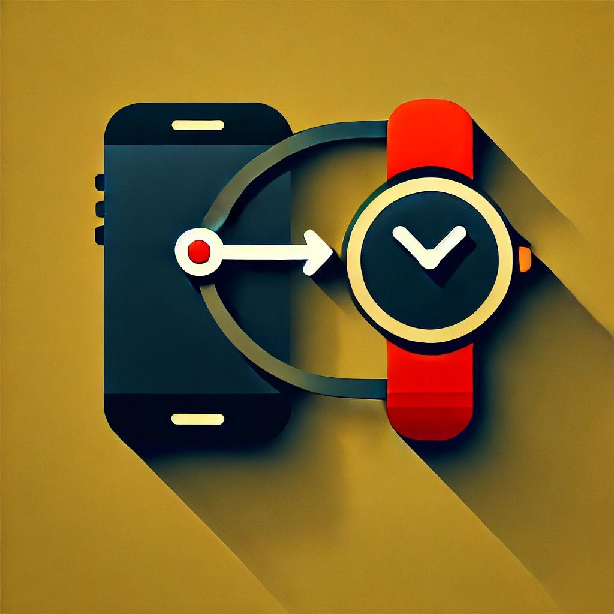
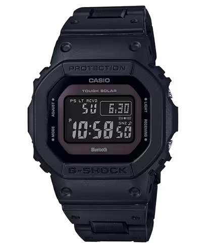
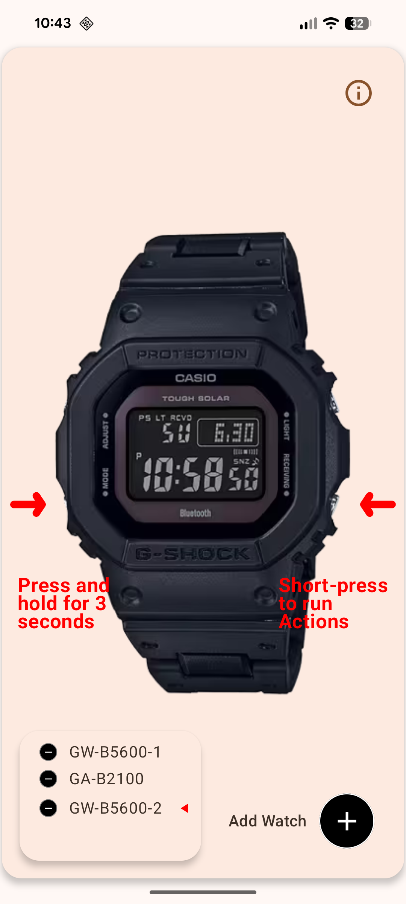
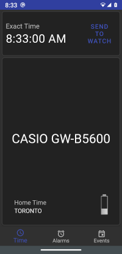
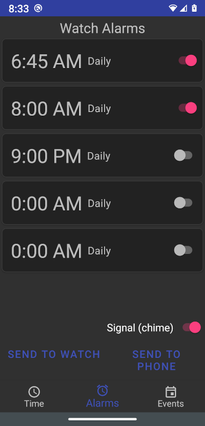
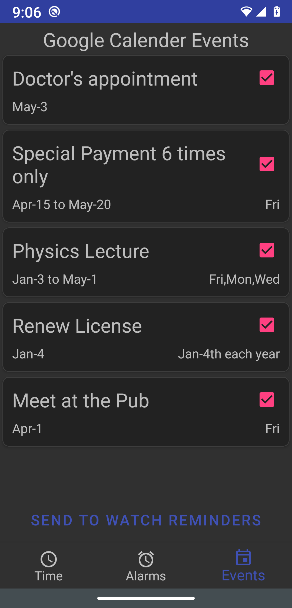
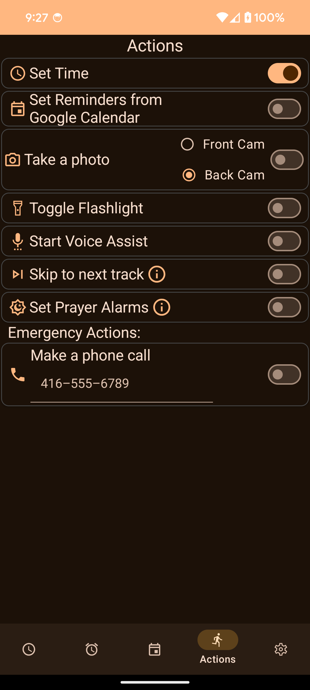
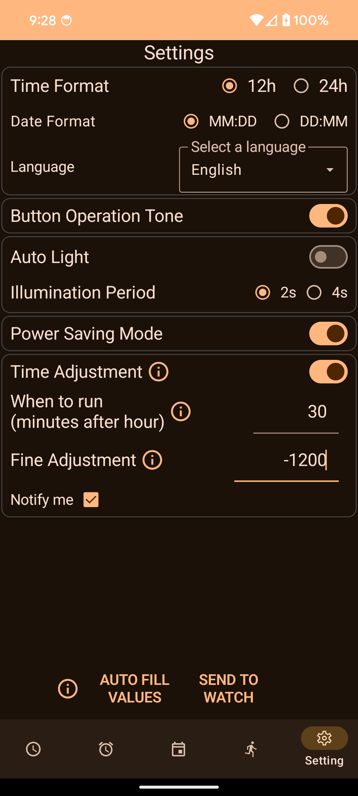

# Casio G-Shock Smart Sync

<p align="center">
  
</p>

[](https://f-droid.org/en/packages/org.avmedia.gshockGoogleSync/)
[](https://github.com/izivkov/CasioGShockSmartSync)
[](https://github.com/izivkov/CasioGShockSmartSync/releases)
[](#)

**G-Shock Smart Sync** is an unofficial, open-source Android app for G-Shock, Edifice, and Pro Trek watches. It allows you to control your watch, sync data, and configure settings **without a Casio ID**.

It offers a faster, privacy-focused, and more powerful alternative to the official Casio app.

---

## Key Features

- **No Account Required**: Skip the Casio ID login entirely.
- **Voice Control**: Manage alarms, timers, settings, and reminders using natural language commands.
- **Calendar Sync**: Push your calendar events (Google, Samsung, etc.) to your watch as reminders.
- **Auto Timezone**: Automatically adjusts watch time when you travel.
- **Remote Control**: Use your watch buttons to take photos, control music, or launch voice assistants.
- **Alarm & Timer Sync**: Configure watch alarms and timers easily from your phone.
- **Phone Finder**: Trigger a loud alarm on your phone to find it.
- **Health Integration**: View step counts and fitness metrics for supported models.

---

## Supported Watch Models

The app works with many Bluetooth-enabled G-Shock, Edifice, and Pro Trek models.

<p align="center">
  
  
  
  
</p>

| Series | Compatible Models (Examples) | Note |
|:---|:---|:---|
| **Square** | GW-B5600, GMW-B5000, GW-B5000, DW-B5600, TRN-50 | Classic square design support |
| **CasiOak** | GA-B2100, GBM-2100, GMC-B2100, MRG-B2100 | Octagonal bezel models |
| **G-Steel** | GST-B100 to B1000, GST-W1000, ECB-900 | Metal series |
| **Edifice** | ECB-10 to ECB-2300, EQB-500 to EQB-2000 | Bluetooth Edifice series |
| **MT-G / MR-G** | MTG-B1000/B3000/B3100, MRG-B5000/B2100 | Premium metal and carbon models |
| **Others** | ABL-100WE, GBD-100/200, GBD-H1000/H2000, GPR-B1000 | Step trackers, GPS, and sensors |

---

## App Walkthrough

Here is a guide to the main screens of the application.

### 1. Connection Screen



This is the first screen you see. It handles the Bluetooth connection to your watch.

- **Status**: Shows generic connection status.
- **Scan/Connect**: Automatically scans for your watch.
- **Paired Devices**: Lists your previously connected watches for quick access.

The app communicates directly with the watch via BLE. Connection is typically much faster than the official app (~3.5s vs 12s).

<br clear="all"/>

### 2. Time Setting & Voice Control



Manage your watch's timekeeping and control features via voice.

- **Voice Control**: Tap the microphone icon on the watch name card to issue voice commands. 
    - Say *"Help"* for a full list of supported commands.
    - Examples: *"Set alarm at 7:30 am"*, *"Set timer for 5 minutes"*, *"Disable all alarms"*, *"Reset settings"*.
- **Local Time**: Displays the current time from your phone.
- **Send to Watch**: Tap the button to sync your phone's time, timezone, and DST settings to the watch immediately.
- **Battery & Temp**: Displays the current battery level and temperature reported by the watch.

<br clear="all"/>

### 3. Alarms



Read and configure the alarms stored on your watch.

- **View Alarms**: See the current settings for all 5 alarms and the hourly signal (Chime).
- **Edit**: Tap any alarm to change its time.
- **Sync**: You can send these alarm settings to the watch. 

*Note: Due to Android limitations, we cannot read alarms set in your phone's native Clock app, but we can set the watch's internal alarms.*

<br clear="all"/>

### 4. Events (Calendar & Reminders)



Sync your Android calendars to your watch!

- **Upcoming Events**: Lists future events from your phone's calendars.
- **Send to Watch**: Pushes these events to the watch's Reminder feature.
- **Manual Mode**: Switch to manual mode to create reminders directly in the app that won't be overwritten by your phone calendar.
- **Transliteration**: Automatically converts Cyrillic and other unsupported characters to Latin for watch compatibility.

<br clear="all"/>

### 5. Actions (Remote Control)



Turn your watch into a remote control. Assign actions to button presses on the watch.

- **Available Actions**:
  - **Find Phone**: Make your phone ring loudly.
  - **Take Photo**: Snap a picture with your phone's camera.
  - **Flashlight**: Turn on your phone's flashlight.
  - **Media Control**: Play/Pause and Next Track for music.
  - **Voice Assist**: Launch Google Assistant.
  - **Set Prayer Alarms**: Set the watch's 5 alarms to Islamic Prayer Times.
- **How to use**: Short-press the lower-right button on the watch (when in Time mode) to trigger the selected action.

<br clear="all"/>

### 6. Settings



Configure app and watch preferences.

- **Watch Settings**: Adjust light duration, power saving, date format, language, and more.
- **App Settings**: Configure theme, connection behavior, and notifications.
- **Smart Defaults**: Easily reset all settings to optimal defaults based on your phone's locale and watch model.

<br clear="all"/>

---

## Privacy

G-Shock Smart Sync is built with privacy in mind. We do not require an account, and we do not collect your personal data.
- **No Account Required**: Use all features without a Casio ID.
- **Local Processing**: All data stays on your device.
- **Open Source**: The code is transparent and auditable.

Read our full [Privacy Policy](https://izivkov.github.io/CasioGShockSmartSync/) for more details.

---

## Installation

- **F-Droid**: [Download here](https://f-droid.org/en/packages/org.avmedia.gshockGoogleSync/)
- **GitHub**: [Download APK from Releases](https://github.com/izivkov/CasioGShockSmartSync/releases/)

## Contributing

We welcome contributions!
- **Code**: Submit a PR to add features or fix bugs.
- **Watches**: If you have a G-Shock model not yet supported, functionality can often be added. Donations of test units are also highly appreciated to help expand compatibility.

## Related Projects

| Project | Description |
|:---|:---|
| [**GShockAPI**](https://github.com/izivkov/GShockAPI) | The core Android library that **this app is built on**. It encapsulates all low-level Bluetooth communication and watch protocol logic into a clean Kotlin API. |
| [**G-Shock Time Server**](https://github.com/izivkov/GShockTimeServer) | A Python script that acts as a headless time server for Raspberry Pi or other always-on Linux devices. |
| [**G-Shock API for ESP32**](https://github.com/izivkov/gshock-api-esp32) | Standalone G-Shock time server for ESP32 microcontrollers — no phone or PC required. |
| [**G-Shock Smart Sync Webapp**](https://github.com/izivkov/gshock-smart-sync-webapp) | Experimental web-based app for watch synchronization from a browser via Web Bluetooth. |
| [**gshock_api**](https://github.com/izivkov/gshock_api) | A **Python API library** for G-Shock watches, featuring a pure functional architecture. |

---

## For Developers

### Capturing BLE Messages with Wireshark

Wireshark can be used to inspect the raw Bluetooth Low Energy (BLE) packets exchanged between your Android phone and the G-Shock watch. This is useful for reverse-engineering watch protocols or debugging communication issues.

#### 1. Phone Setup (Enable HCI Snoop Log)

Android has a built-in BLE packet logger. Enable it via Developer Options:

1. Go to **Settings → About Phone** and tap **Build Number** 7 times to enable Developer Options.
2. Go to **Settings → Developer Options**.
3. Enable **Bluetooth HCI Snoop Log** (exact label varies by device/Android version).
4. **Restart Bluetooth** (toggle it off and on) to start logging.
5. Reproduce the action you want to capture (e.g., connect the app to the watch and sync time).
6. Disable the snoop log again, then pull the log file from the device:

```bash
adb bugreport bugreport.zip
```

The HCI log is embedded in the bugreport. Alternatively, on many devices it is available directly at `/sdcard/btsnoop_hci.log`.

#### 2. Install Wireshark

```bash
# Ubuntu / Debian
sudo apt install wireshark

# macOS (Homebrew)
brew install --cask wireshark
```

Or download the installer from [wireshark.org](https://www.wireshark.org/download.html).

#### 3. Open and Filter the Log

1. Open Wireshark and go to **File → Open**, then select `btsnoop_hci.log`.
2. Wireshark will decode the BLE packets automatically.
3. Use display filters to focus on relevant traffic:

| Goal | Filter |
|:---|:---|
| All BLE ATT traffic | `btatt` |
| Specific device by address | `bluetooth.addr == AA:BB:CC:DD:EE:FF` |
| ATT write operations | `btatt.opcode == 0x12` |
| ATT notifications | `btatt.opcode == 0x1b` |

4. Right-click a packet → **Follow → Bluetooth ATT Stream** to trace a full conversation.

---

## License

This project is licensed under the MIT License - see the LICENSE file for details.
