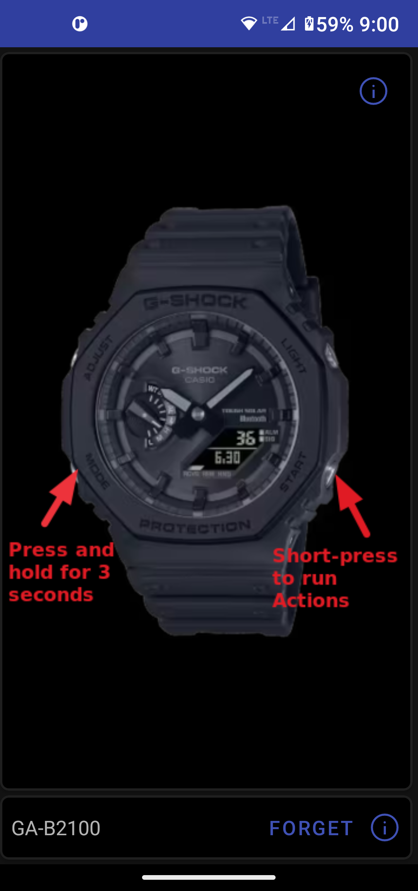
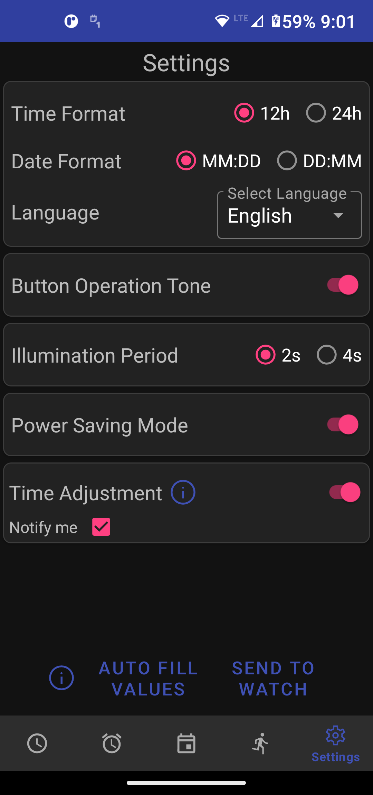

# Casio G-Shock Smart Sync

## Announcements

1. You might have noticed the app icon has changed along with some other minor visual changes. Google Play Store has issued a policy violation against the app for **Impersonation**, most likely brought by Casio.
I will not comment on the merits, but to fully comply, I would have to remove all references to G-Shock. Obviously, I cannot do that, and I have appealed. However, there is a good chance the app will be removed from the Play Store.
It will still be available on F-DROID, and I will build APKs for download here on GitHub.

2. ***Note:*** *Starting from version v21.4, we have temporarily disabled automatic translation because it is causing instability for some users who are unable to access Google Services. We will reintroduce it once we are able to resolve the issue.*

## What is it?
I think we can do better than the official Casio G-Shock App! This app provides the following extra features:

- Sets watch's reminders from Google Calendar
- Automatically sets correct timezone when travelling. No need to switch between Word Time and Home time
- Use your watch to trigger actions on your phone remotely, like taking pictures, dialling a phone number, etc.
- Allows you to set when auto-time adjustment will run.
- Auto-configure most watch settings from phone's configuration.
- Phone's alarms can be synced with watch's alarms.
- Super fast connection time: 3.5 seconds vs 12 seconds for the official app.

# Supported Watches

The app will try to connect and adopt to any Casio watch that wants to connect to it (not just G-Shock). Surprisingly, many models will work "right off the bat". Here are some watches which are reported to work with the app:

G(M)W-5600, G(M)W-5000, GA-B2100, GA-B001-1AER, GST-B500, GST-B200, MSG-B100, G-B001, GBD-H1000 (Partial support), MRG-B5000, GCW-B5000, GG-B100, Edifice ECB-30, ECB-10, ECB-20, most Edifice watches, most Protrek models.

[Let us know](mailto:izivkov@gmail.com) if it works with other watches, and if you like us to add support for your watch.

_**Note**: I am trying to get more people to find out about this app. I have tried to get it reviewed by some of the YouTube channels specializing in G-Shocks with limited success. 
If you like this app, please ask reviewers to give it a try. Thank you._

## General

The app works by sending commands to the watch via Bluetooth (BLE). The watch data is not persisted on the phone, but instead is read from the watch each time 
a connection is established. Any changes on the app are sent back to the watch, only when the `Send to Watch` button is pressed.  

## Setting Time

The local time can be set from the main screen by pressing the `Send to Watch` button next to the current time display. The app uses your current location to get the local lime.
You can then set the watch time accordingly, without having to change your `World Time` selection on the watch.

This screen also shows your `Home Time` location and battery level.

## Alarms

The B5600/B5000 watches have 5 alarms and a `Signal` or `chime` setting. They are first read from the watch,
and displayed in the app. The alarms can be updated by pressing on the time display of each alarm. 
A dialog will appear which allows you to select the time.

Once the alarms have been set, you can send them to the watch, or send them to the `Alarm Clock` app on the phone. 
Unfortunately, there is currently no way to read the alarms from the `Alarm Clock` app programmatically, 
so we cannot set the watch alarms from this app. However, we can set the `Alarm Clock` app with the watch's alarms.

## Events

>Syncing Your Calendar
Ensure that your phone is set to auto-sync with your Google Account. Without this setting, events added to your phone will not sync with your Google account and will not appear in the app.

# Syncing Your Calendar

Ensure that your phone is set to **auto-sync with your Google Account**. Without this setting, events added to your phone will not sync with your Google account and will not appear in the app.

## About This Screen

This screen displays events from your Google Calendar and allows you to send these events to your watch's reminders. *(Note: These are distinct from reminders in the Google Calendar app. The watch reminders are a unique feature and cannot be accessed programmatically.)*

## Event Types and Compatibility

Google Calendar supports various types of events:

- **One-time events**: Single occurrences.
- **Repeating events**: Daily, weekly, monthly, yearly, or complex patterns (e.g., "every second Thursday of the month").
- **Count events**: Limited repetitions, such as "repeat 12 times every Monday."

While the app does its best to adapt calendar events to the watch, some limitations exist:

- **Not Supported**: Daily events and complex patterns (e.g., "every second Thursday of the month").
- **Count Events**: Simulated on the watch using a start and end date, adjusted to match the event's start time, frequency, and count.

Events that cannot be adapted will appear as **Incompatible**. Only future events and ongoing recurring events are displayed.

## Watch-Specific Behavior

The watch only supports **all-day reminders**. For Google Calendar events with a specific time, the app will convert them into all-day reminders on the watch while still retaining their date.

## Actions

The selected actions are run when the user short-presses the lower-right watch button from disconnected mode (initial screen). Using these actions, the watch acts like a remote control for your phone.

## Settings

This screen allows you to set up the watch's settings. You can auto prefill the values using information from your phone.

## Where are my World Cities?
Using an app to manually swap between Home Time and World Time is a bit silly. Your phone already knows where you are. 
When setting time, this app will also set the Home Time, Timezone and DST state to your current location. 
So when travelling to another timezone, just set time and you are good to go.

## Build Your Own App
For those who want to build their own Android app for interfacing with the G-Shock 5000/5600 watches, I have also created an API (library) project [here](https://github.com/izivkov/GShockAPI). 

## Similar Project
If you rather not use a mobile app, but still like to set the time on your G-Shock to the correct time,
here is a [Python program](https://github.com/izivkov/GShockTimeServer) which can run as a server on a regular PC or Raspberry PI with Bluetooth interface.
The project is still WIP, but you can give it a try.

