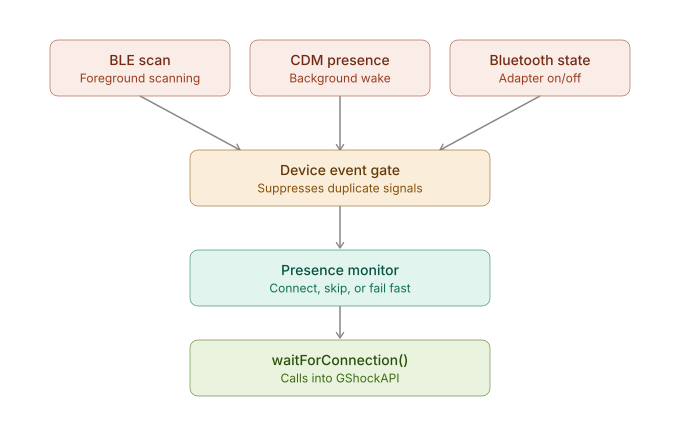
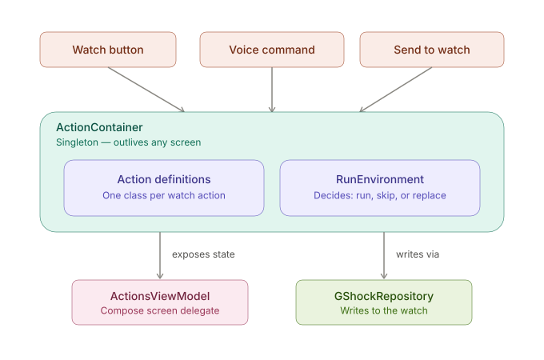

# Technical Overview

This document is a map, not a reference. It explains how the pieces of the
app fit together and why they're shaped the way they are, so you can find
your way to the right file quickly. For details on any one piece, read that
file's own comments — they're kept up to date; this document intentionally
isn't a duplicate of them.

## What this app is

G-Shock Smart Sync talks to Casio's Bluetooth-enabled watches (G-Shock,
Edifice, Pro Trek) directly over BLE, without the official Casio app or a
Casio account. It syncs time, alarms, reminders (from your phone's
calendar), and settings; it also lets the watch's own buttons trigger
actions on the phone (flashlight, camera, find-phone, media controls,
voice commands) even when the app has no screen open.

That last point — "even when the app has no screen open" — shapes a lot of
the architecture. A watch button press can happen at any time, including
while the phone is asleep and no Activity exists. The app has to be able
to react to that, which is why several pieces here are **singletons that
outlive any screen**, not the ViewModels you'd expect in a typical Compose
app.

## Two repositories, not one

This app depends on a separate library, **[GShockAPI](https://github.com/izivkov/GShockAPI)**,
published via JitPack (`implementation(libs.gshockapi)` in `app/build.gradle`).
The split is by concern:

- **`GShockAPI`** — owns the Bluetooth connection itself: pairing, GATT,
  characteristic reads/writes, the Casio wire protocol, and a small
  pub/sub event bus (`ProgressEvents`) that this app listens to. It knows
  nothing about Android UI, calendars, or notifications.
- **`CasioGShockSmartSync`** (this repo) — owns everything user-facing:
  screens, calendar/notification integration, local storage, voice
  commands, and the logic for *which* watch action should run *when*.

You can't fully understand a connection bug by reading only this repo —
things like BLE retry logic, MTU negotiation, and the notification-based
watch protocol live in `GShockAPI`. When you need to look there, the
library is small enough to clone and grep directly.

## The mental model: one shared event bus

Almost nothing in this app calls another part of the app directly. Instead,
nearly everything communicates through `ProgressEvents` (defined in
`GShockAPI`): a global, string-keyed pub/sub bus. Some component calls
`ProgressEvents.onNext("SomeEvent", payload)`, and every part of the app
that previously called `ProgressEvents.runEventActions(name, actions)`
with a handler for `"SomeEvent"` gets it.

This is *the* thing to understand before reading any individual file,
because it explains why so many classes look self-contained despite the
app clearly being one connected system — they're connected through the
bus, not through direct references. A few event names worth knowing
because they show up everywhere: `"ConnectionSetupComplete"`,
`"WatchInitializationCompleted"`, `"Disconnect"`, `"DeviceAppeared"` /
`"DeviceDisappeared"`, `"SettingsUpdated"`, `"AlarmsUpdated"`,
`"EventsUpdated"`.

**One subtlety worth knowing up front:** each subscription needs a unique
name, or a second registration under a name that's already taken is
silently dropped. Use `subscribeToProgressEvents()`
(`utils/ProgressEventsExt.kt`) rather than inventing your own name scheme —
it exists specifically to avoid this failure mode.

## How a connection actually happens

This is the most complex flow in the app, because a watch can connect
through several different Android mechanisms depending on *why* it's
connecting:

1. **Foreground BLE scan** (`receivers/BleScanReceiver.kt`) — used while
   the app is actively looking for a watch (e.g. first pairing, or the
   connection screen is open).
2. **Companion Device Manager presence observation**
   (`services/GShockCompanionDeviceService.kt`) — an Android system service
   that can wake the app in the background when a *previously paired*
   watch comes into range, without the app needing to keep scanning
   itself. This is what lets a watch button press reconnect the app from
   a fully backgrounded state.
3. **Bluetooth adapter state changes** (`receivers/BluetoothStateReceiver.kt`)
   — reacts to the phone's Bluetooth being toggled on/off.

All three paths converge on the same signal: a `"DeviceAppeared"` /
`"DeviceDisappeared"` event, filtered through
`utils/DeviceEventGate.kt` first. The gate's job is narrow but important:
BLE scan results and CDM callbacks can both fire rapidly and repeatedly
for the same physical device, so the gate rate-limits duplicate
`"DeviceAppeared"` signals for the same address before they reach the rest
of the app. If you ever see logs full of `"suppressing duplicate BLE
DeviceAppeared"`, this is where that's coming from — it's usually working
as intended, not evidence of a problem by itself.

The class that actually *acts* on a `"DeviceAppeared"` event is
`pairing/CompanionDevicePresenceMonitor.kt` — a `@Singleton` that calls
`GShockRepository.waitForConnection(address)`. It's deliberately not tied
to any screen, for the "no UI exists yet" reason above.

`GShockRepository` (`data/repository/GShockRepository.kt`) is a thin Hilt
wrapper — `class GShockRepository @Inject constructor(api: GShockAPI) :
IGShockAPI by api` — that exists purely so the rest of the app depends on
an injectable, mockable type instead of constructing `GShockAPI` directly.
Nearly everything in this app that talks to the watch goes through this
repository.

## App bootstrap

- **`GShockApplication.kt`** (`@HiltAndroidApp`) is where the
  always-alive singletons get wired up: `MainEventHandler` (subscribes to
  the app-level events above and drives which screen is showing) and
  `ActionRunner` (see below) are both set up in `onCreate()`, *not* from a
  Composable — again, so they work before any screen exists.
- **`MainActivity.kt`** hosts the Compose UI and screen navigation.
- **`Screens.kt`** / `BottomNavigationBarWithPermissions.kt` define the
  actual navigable screens once a connection is established: Alarms,
  Events (reminders), Time, Settings, Actions.

## The Actions system

"Actions" are the things a watch button press, a voice command, or an
explicit "Send to Watch" UI button can trigger — set the time, push
reminders, toggle the flashlight, take a photo, set an alarm, and so on.
This subsystem lives in `ui/actions/` and is split into two classes on
purpose:

- **`ActionContainer.kt`** — a `@Singleton`, not a ViewModel. It owns the
  actual list of `Action` objects, persists their enabled/config state,
  and decides *whether* a given action should run for a given trigger
  (`RunEnvironment`: `ACTION_BUTTON_PRESSED`, `VOICE_COMMAND`,
  `NORMAL_CONNECTION`, `AUTO_TIME_ADJUSTMENT`, `DIRECT_INVOCATION`, etc.).
  Same "must survive without a screen" reasoning as above.
- **`ActionsViewModel.kt`** — a real, screen-scoped `@HiltViewModel` that
  just forwards to `ActionContainer` for the Compose Actions screen. This
  is what lets that screen use the normal `hiltViewModel()` mechanism
  instead of reaching into a singleton by hand.

Each concrete action (`SetAlarmAction`, `SetEventsAction`,
`SetSettingsAction`, `SetTimerAction`, `PhotoAction`, `ToggleFlashlightAction`,
...) is an inner class of `ActionContainer`, which gives it free access to
shared dependencies without its own constructor boilerplate. Several of
these are also invoked directly from a feature screen's "Send to Watch"
button (`RunEnvironment.DIRECT_INVOCATION`), not just from a watch button
or voice command — so the same write path is shared by all three triggers
instead of being duplicated per screen.

## Voice commands

`voice/` is a self-contained pipeline: `VoiceCommandManager` wraps Android
speech recognition, `IntentParser` turns recognized text into a typed
`VoiceCommand`, and `VoiceDispatcher` maps that command onto the
corresponding `ActionContainer` action (via `RunEnvironment.VOICE_COMMAND`
or `DIRECT_INVOCATION`) and runs it. `VoiceCommandTable.kt` is the static
list of what phrases map to what actions. The UI's job (mic button on the
Time screen) is only to start listening and hand the recognized text to
`VoiceDispatcher` — it doesn't know anything about what the command does.

## Feature screens and their ViewModels

Each main screen has an ordinary `@HiltViewModel` in its own package
under `ui/` (`AlarmViewModel`, `EventViewModel`, `SettingsViewModel`,
`TimeViewModel`). These follow a consistent shape:

1. Load current state from the watch (`GShockRepository`) on init, and
   again on relevant `ProgressEvents` (e.g. reload alarms on
   `"AlarmsUpdated"`).
2. Hold that state in a `StateFlow` for Compose to observe.
3. On a "send to watch" action, either call the repository directly for
   simple reads, or go through the matching `ActionContainer` action
   (`DIRECT_INVOCATION`) when the write needs to stay consistent with what
   a voice command or watch button would do for the same feature.

## Local storage

`scratchpad/` holds everything persisted on the phone that isn't stored
on the watch itself: alarm names (the watch only stores times, not
labels), calendar-vs-manual reminder mode, per-user time-zone
preferences, and which Actions are enabled. Most of these are small
key/value wrappers around `SharedPreferences` via a shared
`ScratchpadManager`/`ScratchpadClient`; none of it is a database, and none
of it needs to be — the amount of state is small and mostly mirrors what's
already on the watch.

## System integration

- **`services/GShockCompanionDeviceService.kt`** — the CDM presence
  listener described above (Android 12+).
- **`services/NotificationMonitorService.kt`** — reads the phone's own
  notifications (when the user grants notification-listener access) and
  forwards selected ones to the watch as `AppNotification`s.
- **`services/BootReceiver.kt`** — re-arms background watch monitoring
  after a phone reboot.
- **`services/LocationProvider.kt`** — used for automatic timezone
  detection so the watch's time stays correct while traveling.

## Where to actually go next

Reading order for getting oriented, roughly in the order you'll need it:

1. `GShockApplication.kt` — what gets wired up at startup, and why.
2. `MainEventHandler.kt` — the app-level reaction to `ProgressEvents`.
3. `pairing/CompanionDevicePresenceMonitor.kt` +
   `receivers/BleScanReceiver.kt` — how a connection actually starts.
4. `ui/actions/ActionContainer.kt` — the biggest single file in the app,
   and the one most other features route through.
5. Whichever feature ViewModel matches what you're changing
   (`ui/alarms`, `ui/events`, `ui/settings`, `ui/time`).

For anything involving the Bluetooth link itself (pairing failures, GATT
errors, protocol details, stale-connection detection), the answer is
usually in the `GShockAPI` repo, not here — start with
`ble/Connection.kt` and `ble/IGShockManager.kt` there.