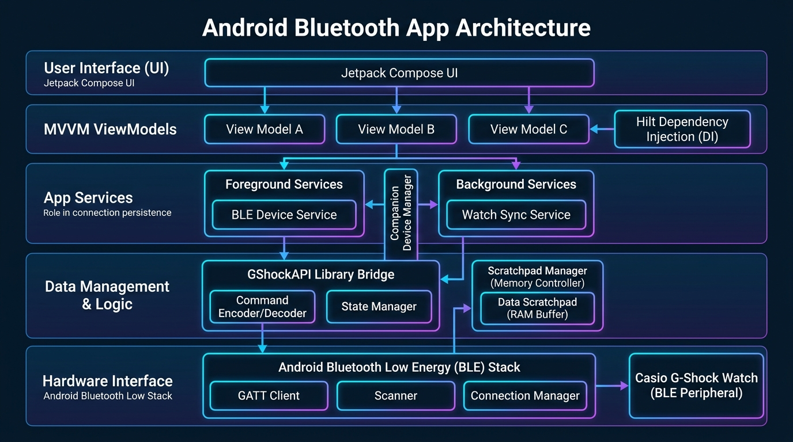
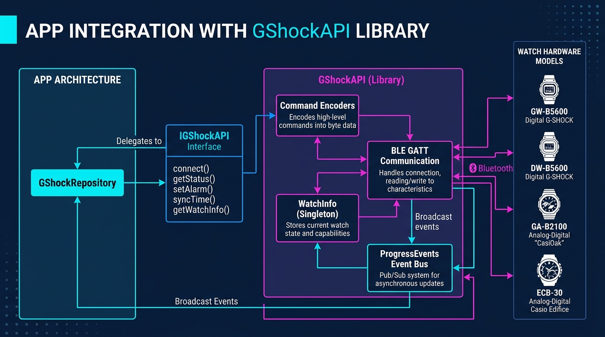
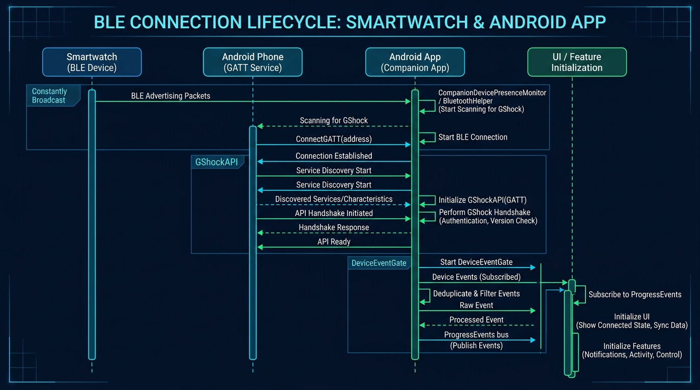
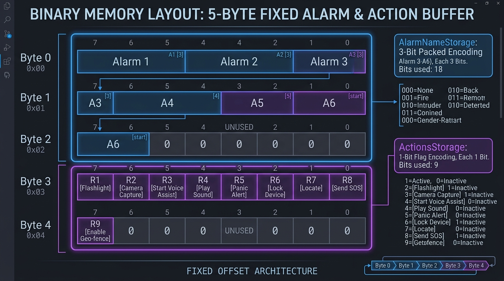
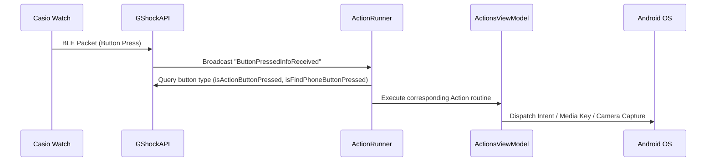
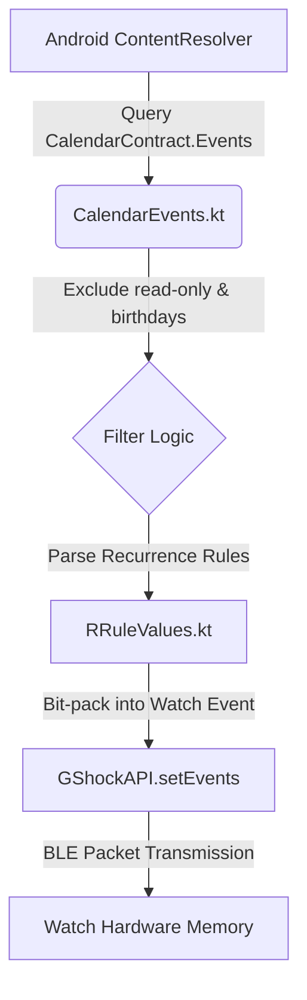

# Technical Overview: Casio G-Shock Smart Sync

This document provides a comprehensive technical breakdown of the architecture, internal data structures, reactive state management, background execution model, and library integrations of the **Casio G-Shock Smart Sync** Android application.

---

## 1. System Architecture & High-Level Design

The application is structured following modern Android architectural standards: **MVVM (Model-View-ViewModel)** with single-direction data flow, **Jetpack Compose** for reactive UI rendering, and **Hilt (Dagger)** for dependency injection.



### Core Technology Stack
- **Language**: 100% Kotlin
- **UI Framework**: Jetpack Compose (Declarative UI with state-driven recomposition)
- **Dependency Injection**: Dagger-Hilt (`@Singleton`, `@HiltViewModel`, `@InstallIn(SingletonComponent::class)`)
- **Asynchronous Processing**: Kotlin Coroutines & `Flow` / `StateFlow`
- **BLE Abstraction**: `com.github.izivkov:GShockAPI`
- **Event Bus**: `ProgressEvents` (Reactive Pub/Sub mechanism inside `GShockAPI`)

### Directory & Package Structure
```
org.avmedia.gshockGoogleSync
├── data/repository/          # Repository abstraction over GShockAPI
├── di/                       # Hilt DI modules (ApiModule, FeatureModule, RepositoryModule)
├── pairing/                  # Device association & presence monitoring (CompanionDevicePresenceMonitor)
├── receivers/                # BroadcastReceivers for Bluetooth state & BLE scanning
├── scratchpad/               # Fixed-offset binary memory manager & clients
├── services/                 # CompanionDeviceService, KeepAlive, NotificationMonitor
├── ui/                       # Jetpack Compose screens & ViewModels
│   ├── actions/              # ActionRunner, ActionViewModel, Remote Action Handlers
│   ├── alarms/               # AlarmViewModel, Alarm items & chimes
│   ├── common/               # Design system components, WatchFeature visibility wrappers
│   ├── events/               # CalendarEvents query engine & RRule parsing
│   ├── settings/             # SettingsViewModel, Power saving, Operation tones, Locale
│   └── time/                 # TimeViewModel, Home Time layout, Solar time, Battery status
└── utils/                    # BluetoothHelper, DeviceEventGate, LocalDataStorage
```

---

## 2. GShockAPI Library Integration

The **GShockAPI** (`org.avmedia.gshockapi`) serves as the hardware translation layer between high-level application intents and low-level Bluetooth Low Energy (BLE) GATT attributes.



### Dependency Injection & Interface Delegation

Rather than accessing `GShockAPI` directly across ViewModels and Services, the app wraps the API inside `GShockRepository` located at `org/avmedia/gshockGoogleSync/data/repository/GShockRepository.kt`. 

```kotlin
@Singleton
class GShockRepository @Inject constructor(
    api: GShockAPI
) : IGShockAPI by api
```

`GShockRepository` uses Kotlin's **interface delegation** (`by api`) to implement `IGShockAPI`. `GShockAPI` itself is instantiated as a singleton via Hilt in `ApiModule.kt`:

```kotlin
@Module
@InstallIn(SingletonComponent::class)
object ApiModule {
    @Provides
    @Singleton
    fun provideGShockAPI(@ApplicationContext context: Context): GShockAPI {
        return GShockAPI(context)
    }
}
```

### Low-Level BLE Communication Protocol

`GShockAPI` encapsulates the complex GATT read/write operations required by Casio G-Shock watches:

1. **GATT Characteristic Requests**: Command encoders serialize high-level calls (e.g., `setAlarm()`, `setTime()`, `getWatchName()`) into raw byte packets formatted specifically for Casio GATT services.
2. **Asynchronous Byte Response Decoding**: Responses from watch characteristics are parsed, decoded, and converted into domain data objects (e.g., `WatchInfo`, `BatteryLevel`, `TimerValue`).
3. **`ProgressEvents` Pub/Sub Bus**: The API uses a static reactive event bus `ProgressEvents` to dispatch state changes across the application without tight coupling.

```kotlin
// Subscribing to API events in app components:
val eventActions = arrayOf(
    EventAction("ConnectionSetupComplete") { /* Watch connected & handshake done */ },
    EventAction("ButtonPressedInfoReceived") { /* Watch button pressed */ },
    EventAction("WatchInitializationCompleted") { /* Capabilities resolved */ }
)
ProgressEvents.runEventActions(Utils.AppHashCode(), eventActions)
```

### Watch Hardware Model Resolution

Upon completing the BLE handshake, `GShockAPI` queries characteristic `0x0001` to determine the exact hardware model (e.g., `GW-B5600`, `DW-B5600`, `GA-B2100`, `ECB-30`). The model features and limits (e.g., number of alarms, reminder length, light duration options, presence of solar charging) are populated into the `WatchInfo` singleton inside `GShockAPI`.

---

## 3. Bluetooth Connection Lifecycle & Background Persistence

Connecting to a BLE watch involves two distinct entry points: explicit foreground scanning/pairing and silent background reconnection via Android's `CompanionDeviceManager`.



### Foreground Connection (`BluetoothHelper`)
When opened in the foreground, `BluetoothHelper` verifies runtime permissions (`BLUETOOTH_CONNECT`, `BLUETOOTH_SCAN`, `ACCESS_FINE_LOCATION`) and initiates scanning. Upon locating the paired MAC address, `GShockAPI.connect()` establishes the GATT connection.

### Background Reconnection (`GShockCompanionDeviceService`)
To sync time or trigger remote actions when the phone is locked or the app is closed, the app relies on Android's `CompanionDeviceService` framework:

1. **Presence Observation**: `DeviceAssociationManager` registers the watch's MAC address with Android's system `CompanionDeviceManager`.
2. **Hardware Wake Event**: When the watch broadcasts BLE advertising packets in range, Android wakes `GShockCompanionDeviceService`.
3. **Foreground Service Promotion**: The service instantly invokes `startForeground()` with notification channel `gshock_companion_channel` and service type `FOREGROUND_SERVICE_TYPE_CONNECTED_DEVICE` (API 34+) to prevent OS process termination during active synchronization.
4. **Event Deduplication (`DeviceEventGate`)**: Because both system BLE scanning and Companion Device Manager events can fire simultaneously, `DeviceEventGate` filters duplicate `DeviceAppeared` / `DeviceDisappeared` signals using atomic timestamp gating.

---

## 4. Scratchpad Fixed-Offset Memory Management

Casio G-Shock watches provide a small non-volatile RAM region called the **Scratchpad**. Since official Casio firmware does not support custom alarm titles or arbitrary action settings, Smart Sync uses a custom binary packing scheme to persist user configurations directly on the watch hardware.



### Fixed-Offset Architecture

To prevent memory corruption across app restarts or out-of-order client registration, the application utilizes a **fixed offset layout** defined in `ScratchpadManager.kt`:

| Byte Offset | Size | Client | Bit Encoding Description |
|---|---|---|---|
| **0x00** | 3 Bytes | `AlarmNameStorage` | Bit-packed 3-bit string indices for 6 custom alarm names (18 bits total) |
| **0x03** | 2 Bytes | `ActionsStorage` | 1-bit boolean flags for 9 remote action toggle states (9 bits total) |
| **Total** | **5 Bytes** | | **Fixed Scratchpad Buffer** |

### Bit-Packing Mechanics

#### 1. `AlarmNameStorage` (Offset 0x00, 3 Bytes)
- Stores 6 custom alarm names selected by the user.
- Each name is mapped to a 3-bit index (0–5 for predefined names, 7 for "no name").
- 6 alarms $\times$ 3 bits = 18 bits, packed into Bytes 0, 1, and 2.

```
Byte 0: [ Alarm 2 (upper 2 bits) | Alarm 1 (3 bits) | Unused (3 bits) ]
Byte 1: [ Alarm 4 (3 bits)       | Alarm 3 (3 bits) | Alarm 2 (lower 1 bit) ]
Byte 2: [ Unused (2 bits)        | Alarm 6 (3 bits) | Alarm 5 (3 bits) ]
```

#### 2. `ActionsStorage` (Offset 0x03, 2 Bytes)
- Manages 9 remote control boolean flags.
- Each action state occupies exactly 1 bit.

```kotlin
enum class Action {
    SET_TIME,           // Bit 0 (Byte 3)
    REMINDERS,          // Bit 1 (Byte 3)
    PHONE_FINDER,       // Bit 2 (Byte 3)
    TAKE_PHOTO,         // Bit 3 (Byte 3)
    FLASHLIGHT,         // Bit 4 (Byte 3)
    VOICE_ASSIST,       // Bit 5 (Byte 3)
    SKIP_TO_NEXT_TRACK, // Bit 6 (Byte 3)
    PRAYER_ALARMS,      // Bit 7 (Byte 3)
    PHONE_CALL          // Bit 0 (Byte 4)
}
```

### The `ScratchpadClient` Interface & Sync Flow

Every storage module implements `ScratchpadClient` and registers with `ScratchpadManager`:

```kotlin
interface ScratchpadClient {
    fun getStorageOffset(): Int
    fun getStorageSize(): Int
    fun setBuffer(buffer: ByteArray)
    fun getBuffer(): ByteArray
}
```

```
[UI Component Modification]
        ↓
ActionsStorage.saveAction(Action.FLASHLIGHT, true)
        ↓
Bit set in local ByteArray at Offset 0x03
        ↓
ScratchpadManager.save()
        ↓
GShockAPI.setScratchpad(buffer)  →  [BLE Write to Watch Characteristic]
```

---

## 5. Actions Pipeline & Remote Control Engine

The actions pipeline allows watch button presses to execute Android system commands.



### Routing & Button Signal Handlers

`ActionRunner` (`ui/actions/ActionRunner.kt`) listens for `ButtonPressedInfoReceived` events from `ProgressEvents`:

- **Action Button (Lower-Right)**: Triggers enabled routines in `ActionsViewModel` (e.g., Flashlight, Camera capture, Voice assistant, Media next track).
- **Find Phone Button**: Executes `ActionViewModel.runActionFindPhone()`, initiating high-volume audio playback via `PhoneFinder`.
- **Auto Time Sync Button**: Triggers `WatchTimeUpdater.update()` to sync phone clock precision to the watch hands/display.

### Remote Execution Modules
- **`CameraCaptureHelper`**: Employs Android `CameraX` APIs to capture a photo in the background without launching the main camera UI.
- **`FlashlightHelper`**: Toggles phone camera LED via `CameraManager.setTorchMode()`.
- **`SkipToNextTrackView`**: Synthesizes a system `KeyEvent.KEYCODE_MEDIA_NEXT` media key via `AudioManager`.

---

## 6. Calendar Event Synchronization Engine

The calendar engine converts Android `CalendarContract` data into binary `Event` structures compatible with G-Shock reminder displays.



1. **Content Query**: `CalendarEvents.kt` queries `CalendarContract.Events` via `ContentResolver`.
2. **Filtering**: Excludes read-only calendars, holidays, and auto-generated contact birthdays to conserve watch memory slots.
3. **Recurrence Parsing**: `RRuleValues.kt` parses standard iCalendar `RRULE` strings into watch-compatible frequency indices (daily, weekly, monthly, annual).
4. **Binary Packing**: Formats event title (truncated to 18 characters) and start/end timestamps into binary structures.
5. **Sync Trigger**: Executes automatically during every automated time-sync handshake or when notified by `CalendarObserver`.

---

## 7. Reactive Hardware Feature Management

Because Casio G-Shock models differ significantly in hardware capabilities (e.g., solar state, step counter, operation tone control), the UI dynamically adapts using `WatchFeatureManager`.

### Compose Feature Wrapper (`WatchFeature.kt`)

UI elements requiring specific hardware features are wrapped inside `WatchFeature`:

```kotlin
@Composable
fun WatchFeature(
    feature: WatchFeatureManager.Feature,
    content: @Composable () -> Unit
) {
    if (WatchFeatureManager.isFeatureSupported(feature)) {
        content()
    }
}
```

Upon receiving `ConnectionSetupComplete`, `WatchFeatureManager` queries `GShockRepository.getWatchInfo()` to evaluate supported feature flags, dynamically showing or hiding Compose UI components across `SettingsScreen`, `TimeScreen`, and `AlarmsScreen`.
